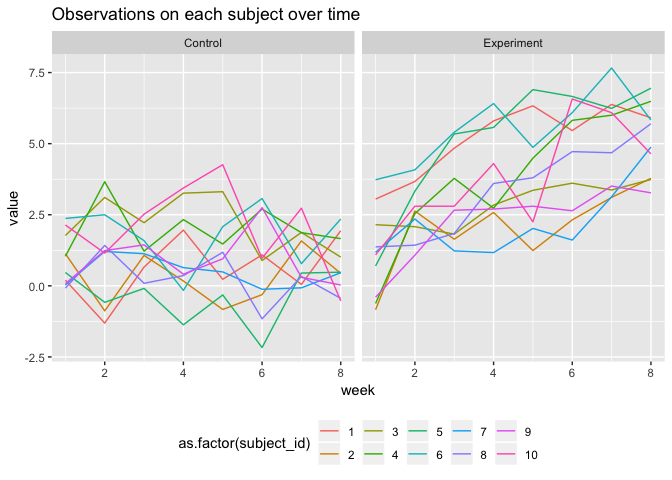
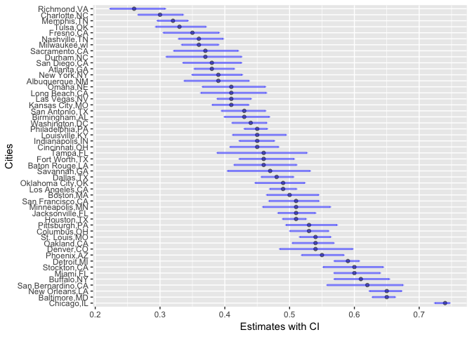

p8105\_hw5\_dz2399
================
DZ
November 1, 2018

Creating a dataset
------------------

``` r
files_name <- list.files('./data1')

read_df <- function(x){
  df <- read_csv(paste0('./data1/',x))
  df}

id <- files_name %>% 
  str_replace('.csv','') %>%
  str_split('_',simplify = T)                                                         
colnames(id) <- c('arm','subject_id')
id <- mutate(as.tibble(id), subject_id=as.numeric(subject_id))
  
df_all <- purrr::map(files_name,read_df) %>% 
  bind_rows(.id='id') 

df_all <- cbind(id,df_all) %>% 
  gather(key=week, value=value, week_1:week_8) %>% 
  mutate(week=str_replace(week, 'week_','')) %>% 
  mutate(week=as.numeric(week))

label <- c('con'='Control', 'exp'='Experiment')

ggplot(df_all, aes(x=week, y=value))+
  facet_grid(.~arm,labeller=as_labeller(label))+
  geom_line(aes(color=as.factor(subject_id)))+
  ggtitle('Observations on each subject over time')+
  theme(legend.position='bottom')
```



As the graph shows, the experiment group shows an increasing trend over time while the control group stays the same.

Question 2
----------

### Describing the homicide dataset

``` r
df_homicide <- read_csv('./data2/homicide_data.csv') %>%
  janitor::clean_names()
```

The homicide dataset has the dimension of 52179 rows and 12 columns. In the raw data, the character variables are uid, victim\_last, victim\_first, victim\_race, victim\_age, victim\_sex, city, state, disposition. Numeric variables are lat and lon.

### Creating the city\_state variable and summary tables

``` r
df_homicide <- df_homicide %>%
  mutate(city_state = paste(city,state,sep = ',')) 

total_homi <- df_homicide %>% 
  group_by(city_state) %>% 
  summarise(total_homicide = n()) 

unsolved_homi <- df_homicide %>% 
  filter(disposition=='Closed without arrest'|disposition=='Open/No arrest') %>% 
  group_by(city_state) %>% 
  summarise(unsolved_homicide = n()) 


df_total_unsolved <- merge(total_homi,unsolved_homi,by='city_state') 

knitr::kable(df_total_unsolved)
```

| city\_state       |  total\_homicide|  unsolved\_homicide|
|:------------------|----------------:|-------------------:|
| Albuquerque,NM    |              378|                 146|
| Atlanta,GA        |              973|                 373|
| Baltimore,MD      |             2827|                1825|
| Baton Rouge,LA    |              424|                 196|
| Birmingham,AL     |              800|                 347|
| Boston,MA         |              614|                 310|
| Buffalo,NY        |              521|                 319|
| Charlotte,NC      |              687|                 206|
| Chicago,IL        |             5535|                4073|
| Cincinnati,OH     |              694|                 309|
| Columbus,OH       |             1084|                 575|
| Dallas,TX         |             1567|                 754|
| Denver,CO         |              312|                 169|
| Detroit,MI        |             2519|                1482|
| Durham,NC         |              276|                 101|
| Fort Worth,TX     |              549|                 255|
| Fresno,CA         |              487|                 169|
| Houston,TX        |             2942|                1493|
| Indianapolis,IN   |             1322|                 594|
| Jacksonville,FL   |             1168|                 597|
| Kansas City,MO    |             1190|                 486|
| Las Vegas,NV      |             1381|                 572|
| Long Beach,CA     |              378|                 156|
| Los Angeles,CA    |             2257|                1106|
| Louisville,KY     |              576|                 261|
| Memphis,TN        |             1514|                 483|
| Miami,FL          |              744|                 450|
| Milwaukee,wI      |             1115|                 403|
| Minneapolis,MN    |              366|                 187|
| Nashville,TN      |              767|                 278|
| New Orleans,LA    |             1434|                 930|
| New York,NY       |              627|                 243|
| Oakland,CA        |              947|                 508|
| Oklahoma City,OK  |              672|                 326|
| Omaha,NE          |              409|                 169|
| Philadelphia,PA   |             3037|                1360|
| Phoenix,AZ        |              914|                 504|
| Pittsburgh,PA     |              631|                 337|
| Richmond,VA       |              429|                 113|
| Sacramento,CA     |              376|                 139|
| San Antonio,TX    |              833|                 357|
| San Bernardino,CA |              275|                 170|
| San Diego,CA      |              461|                 175|
| San Francisco,CA  |              663|                 336|
| Savannah,GA       |              246|                 115|
| St. Louis,MO      |             1677|                 905|
| Stockton,CA       |              444|                 266|
| Tampa,FL          |              208|                  95|
| Tulsa,OK          |              583|                 193|
| Washington,DC     |             1345|                 589|

Baltimore unsolved proportion table
-----------------------------------

``` r
baltimore <- df_total_unsolved %>% 
  filter(city_state=='Baltimore,MD')

p.test <- prop.test(baltimore$unsolved_homicide,baltimore$total_homicide) 

broom::tidy(p.test)[,c(1,5,6)]
```

    ## # A tibble: 1 x 3
    ##   estimate conf.low conf.high
    ##      <dbl>    <dbl>     <dbl>
    ## 1    0.646    0.628     0.663

Iteration

``` r
p_fun <- function(x){
p.test <- prop.test(x$unsolved_homicide,x$total_homicide) 
broom::tidy(p.test)[,c(1,5,6)]
}

df_all_prop <- nest(df_total_unsolved,total_homicide:unsolved_homicide) %>% 
     mutate(prop_result=map(data,p_fun)) %>% 
     unnest()
df_all_prop
```

    ##           city_state total_homicide unsolved_homicide  estimate  conf.low
    ## 1     Albuquerque,NM            378               146 0.3862434 0.3372604
    ## 2         Atlanta,GA            973               373 0.3833505 0.3528119
    ## 3       Baltimore,MD           2827              1825 0.6455607 0.6275625
    ## 4     Baton Rouge,LA            424               196 0.4622642 0.4141987
    ## 5      Birmingham,AL            800               347 0.4337500 0.3991889
    ## 6          Boston,MA            614               310 0.5048860 0.4646219
    ## 7         Buffalo,NY            521               319 0.6122841 0.5687990
    ## 8       Charlotte,NC            687               206 0.2998544 0.2660820
    ## 9         Chicago,IL           5535              4073 0.7358627 0.7239959
    ## 10     Cincinnati,OH            694               309 0.4452450 0.4079606
    ## 11       Columbus,OH           1084               575 0.5304428 0.5002167
    ## 12         Dallas,TX           1567               754 0.4811742 0.4561942
    ## 13         Denver,CO            312               169 0.5416667 0.4846098
    ## 14        Detroit,MI           2519              1482 0.5883287 0.5687903
    ## 15         Durham,NC            276               101 0.3659420 0.3095874
    ## 16     Fort Worth,TX            549               255 0.4644809 0.4222542
    ## 17         Fresno,CA            487               169 0.3470226 0.3051013
    ## 18        Houston,TX           2942              1493 0.5074779 0.4892447
    ## 19   Indianapolis,IN           1322               594 0.4493192 0.4223156
    ## 20   Jacksonville,FL           1168               597 0.5111301 0.4820460
    ## 21    Kansas City,MO           1190               486 0.4084034 0.3803996
    ## 22      Las Vegas,NV           1381               572 0.4141926 0.3881284
    ## 23     Long Beach,CA            378               156 0.4126984 0.3629026
    ## 24    Los Angeles,CA           2257              1106 0.4900310 0.4692208
    ## 25     Louisville,KY            576               261 0.4531250 0.4120609
    ## 26        Memphis,TN           1514               483 0.3190225 0.2957047
    ## 27          Miami,FL            744               450 0.6048387 0.5685783
    ## 28      Milwaukee,wI           1115               403 0.3614350 0.3333172
    ## 29    Minneapolis,MN            366               187 0.5109290 0.4585150
    ## 30      Nashville,TN            767               278 0.3624511 0.3285592
    ## 31    New Orleans,LA           1434               930 0.6485356 0.6231048
    ## 32       New York,NY            627               243 0.3875598 0.3494421
    ## 33        Oakland,CA            947               508 0.5364308 0.5040588
    ## 34  Oklahoma City,OK            672               326 0.4851190 0.4467861
    ## 35          Omaha,NE            409               169 0.4132029 0.3653146
    ## 36   Philadelphia,PA           3037              1360 0.4478103 0.4300380
    ## 37        Phoenix,AZ            914               504 0.5514223 0.5184825
    ## 38     Pittsburgh,PA            631               337 0.5340729 0.4942706
    ## 39       Richmond,VA            429               113 0.2634033 0.2228571
    ## 40     Sacramento,CA            376               139 0.3696809 0.3211559
    ## 41    San Antonio,TX            833               357 0.4285714 0.3947772
    ## 42 San Bernardino,CA            275               170 0.6181818 0.5576628
    ## 43      San Diego,CA            461               175 0.3796095 0.3354259
    ## 44  San Francisco,CA            663               336 0.5067873 0.4680516
    ## 45       Savannah,GA            246               115 0.4674797 0.4041252
    ## 46      St. Louis,MO           1677               905 0.5396541 0.5154369
    ## 47       Stockton,CA            444               266 0.5990991 0.5517145
    ## 48          Tampa,FL            208                95 0.4567308 0.3881009
    ## 49          Tulsa,OK            583               193 0.3310463 0.2932349
    ## 50     Washington,DC           1345               589 0.4379182 0.4112495
    ##    conf.high
    ## 1  0.4375766
    ## 2  0.4148219
    ## 3  0.6631599
    ## 4  0.5110240
    ## 5  0.4689557
    ## 6  0.5450881
    ## 7  0.6540879
    ## 8  0.3358999
    ## 9  0.7473998
    ## 10 0.4831439
    ## 11 0.5604506
    ## 12 0.5062475
    ## 13 0.5976807
    ## 14 0.6075953
    ## 15 0.4260936
    ## 16 0.5072119
    ## 17 0.3913963
    ## 18 0.5256914
    ## 19 0.4766207
    ## 20 0.5401402
    ## 21 0.4370054
    ## 22 0.4407395
    ## 23 0.4642973
    ## 24 0.5108754
    ## 25 0.4948235
    ## 26 0.3432691
    ## 27 0.6400015
    ## 28 0.3905194
    ## 29 0.5631099
    ## 30 0.3977401
    ## 31 0.6731615
    ## 32 0.4270755
    ## 33 0.5685037
    ## 34 0.5236245
    ## 35 0.4627477
    ## 36 0.4657157
    ## 37 0.5839244
    ## 38 0.5734545
    ## 39 0.3082658
    ## 40 0.4209131
    ## 41 0.4630331
    ## 42 0.6753422
    ## 43 0.4258315
    ## 44 0.5454433
    ## 45 0.5318665
    ## 46 0.5636879
    ## 47 0.6447418
    ## 48 0.5269851
    ## 49 0.3711192
    ## 50 0.4649455

The plot of estimates and CIs for each city

``` r
df_all_prop %>% 
  mutate(estimate=round(estimate,2)) %>% 
  ggplot(aes(x=reorder(city_state,-estimate),y=estimate))+
  geom_bar(stat = 'identity',alpha=.5)+
  geom_errorbar(mapping=aes(x=city_state, ymin=conf.low, ymax=conf.high), width=0.1, size=1, color="blue",alpha=.5)+
    coord_flip()+
  xlab('Cities')+
  ylab('Estimates with CI')
```



``` r
  ggtitle('The estimates and CIs for each city')
```

    ## $title
    ## [1] "The estimates and CIs for each city"
    ## 
    ## $subtitle
    ## NULL
    ## 
    ## attr(,"class")
    ## [1] "labels"

In this graph, we can observe that Chicago, Baltimore, New Orleans, are the top three cities of unsolved case proportions.
